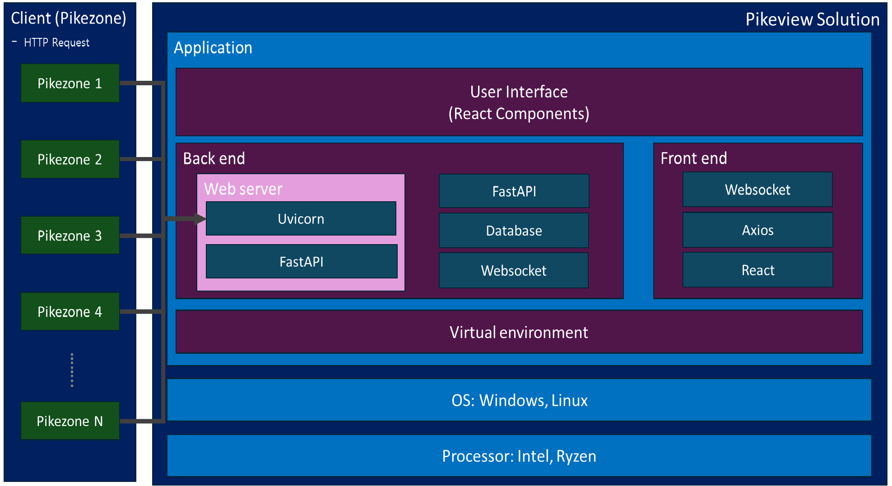
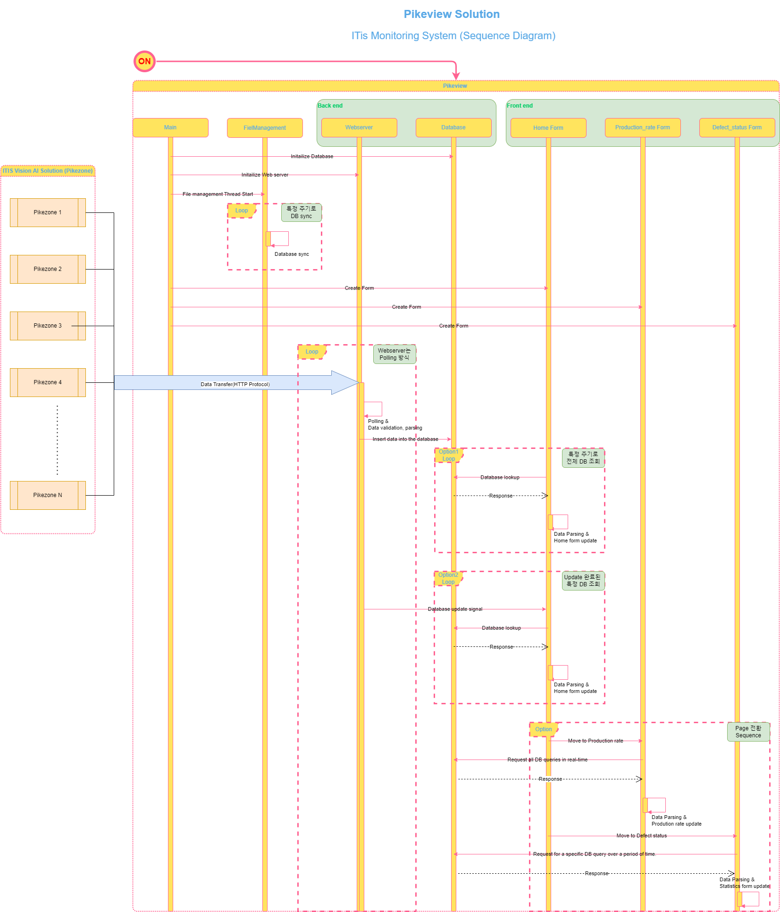
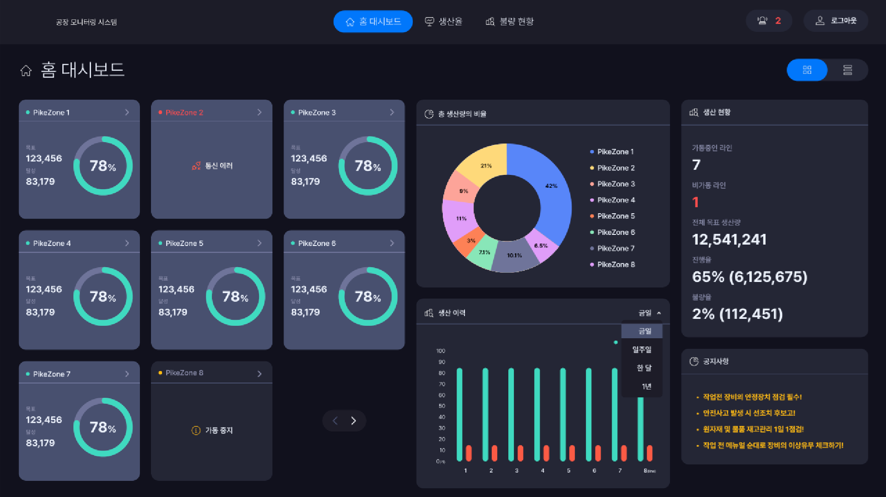
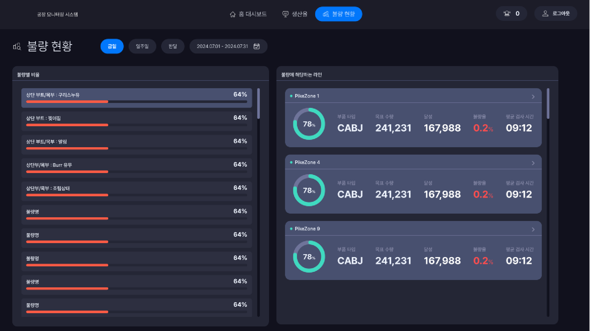

# Pikeview

## HW/SW specifications for PIKEVIEW

```
• CPU : TBD
• GPU : Not USED or Internal Graphic Driver
• SSD : 1TB
• RAM : DDR5 32GB
• USB : 2 or more USB 3.0 ports.

• Ubuntu : 22.04 LTS
• Python version : 3.9
• Package: FAST API, REACT, AXIOS, WEBSOCKET, etc

```
## 프로젝트의 목표
- [ ] [1]Pikezone으로 부터 전달 받은 데이터를 기반으로 Monitoring system을 구축
- [ ] [2]실시간 Monitoring system은 Emergency alert 및 통계 기능 제공
- [ ] [3]Pikeview에 연결되어 있는 각각의 Pikezone status를 확인할 수 있으며, 전반적인 생산율 및 불량 현황을 쉽게 파악하는 기능 제공

## PikeView S/W Architecture


## PikeView의 구성과 설명
- [ ] [Uvicorn/FASTAPI]에서 실시간 N개의 Pikezone 으로부터 data를 전달 받아 각각의 UI Component가 Update 제공
- [ ] [Database] 전달 받은 data를 기반으로 각각의 pikezone의 data를 database에 insert 및 searching 기능 제공
- [ ] [REACT] Back-end(FASTAPI)로 부터 데이터를 전달 받아 각각 Pikezone의 component 에 UI update 기능 제공

## System 운영 사항
* 최대 9개의 Client가 Pikeview에 연결되어 데이터를 전송하여 Monitoring system을 구축
* 실시간 Pikezone으로 부터 전달 받은 data로 React library를 이용하여 UI를 구성하여 사용자가 쉽게 전반적인 상황 판단 가능

## System Sequence Diagram


## SW 구동 화면
* Main display

* Statistics display


### Git 사용법
* 프로젝트 Souorce Download
```shell
git clone http://gitlab.it-is.ai:7788/jayden/pikeview.git
```
* 수정된 사항 GitLab 에 Source code upload

```shell
git add .
git commit -m "COMMIT MESSAGE"
git push -u origin main
```
* 그밖에 Git command는 아래 사이트 참고
- [ ] [Reference : Git Command](https://git-scm.com/doc)
