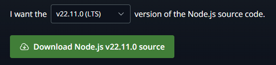
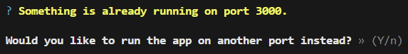

# React App 실행하기

## node.js npm 설치

Node.js 공식 사이트에서 다운로드
Node.js 설치시 자동으로 npm이 같이 설치됨 

### `https://nodejs.org/en/download/source-code`

## 사용하는 node_modules 설치

cmd 혹은 vscode를 사용하여 프로젝트 frontend 폴더 위치에서
(vscode 추천)

### `npm install`

입력하여 구동에 필요하 node_modules 설치

설치 완료 후 

### `npm start`

3000번 포트가 사용중일 때 나오는 메세지

y를 누르면 자동으로 다른 포트가 할당됨 e.g. 3002
